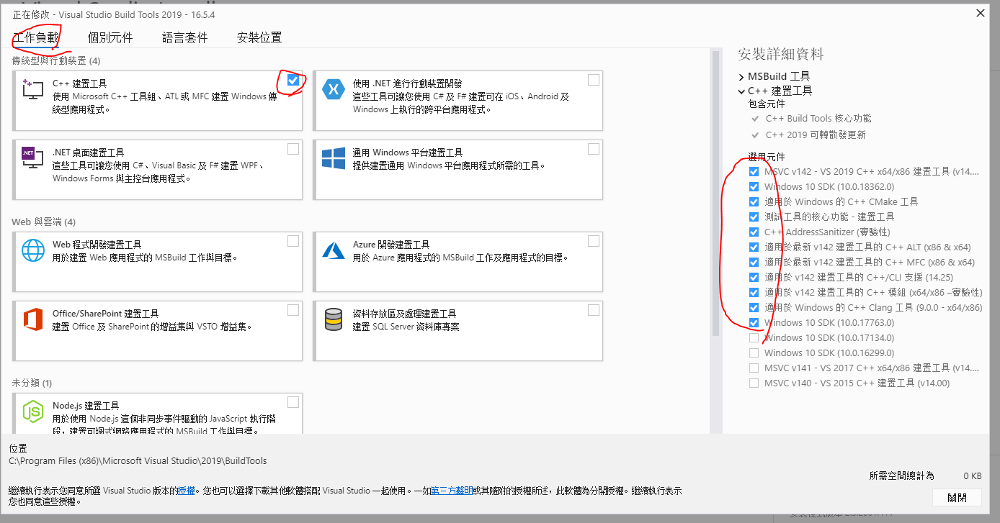
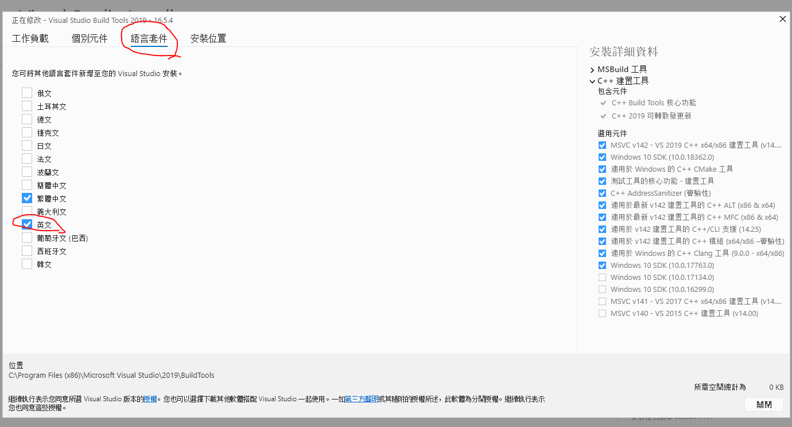

# Hough Map generator

Generate Hough Map for 2D Trigger in Belle-II

## 1. How to build

This porject only support 64 bits OS now.

### 1.1 On the Windows

#### 1.1.1 Requirement

* git
* cmake (version > 3.13)
* Visual Studio 2019 build tool (or Visual Studio 2019), ensure following SDKs of VS2019 has been installed



### 1.2 Build this project

#### 1.2.1 Debug Mode

Assume user now at directory of `readme.md`

``` bash
mkdir build
cd build
cmake -G "Visual Studio 16 2019" -DCMAKE_CONFIGURATION_TYPES="Debug;Release" -A x64 ../src
cmake --build . --config Debug
```

#### 1.2.2 Run after build

Assume user now at directory of `build`

``` bash
./output/bin/Debug/<exec-file>
```

The files of result generated in:

Assume user now at directory of `build`

``` bash
./result
```

### 2.1 On the Linux

#### 2.1.1 Requirement

* git
* cmake (version > 3.13)
* gcc (version > 8.1)

### 2.2 Build this project

#### 2.2.1 Debug Mode

Assume user now at directory of `readme.md`

``` bash
mkdir build
cd build
cmake -DCMAKE_CONFIGURATION_TYPES="Debug;Release" ../src
cmake --build . --config Debug
```

#### 2.2.2 Run after build

Assume user now at directory of `build`

``` bash
./output/bin/<exec-file>
```

The files of result generated in:

Assume user now at directory of `build`

``` bash
./result
```

## 2. Technical report

[refer to here](https://hackmd.io/@BelleII-CDC-Trig-NTU-DeWei/r1BNYq89I)
